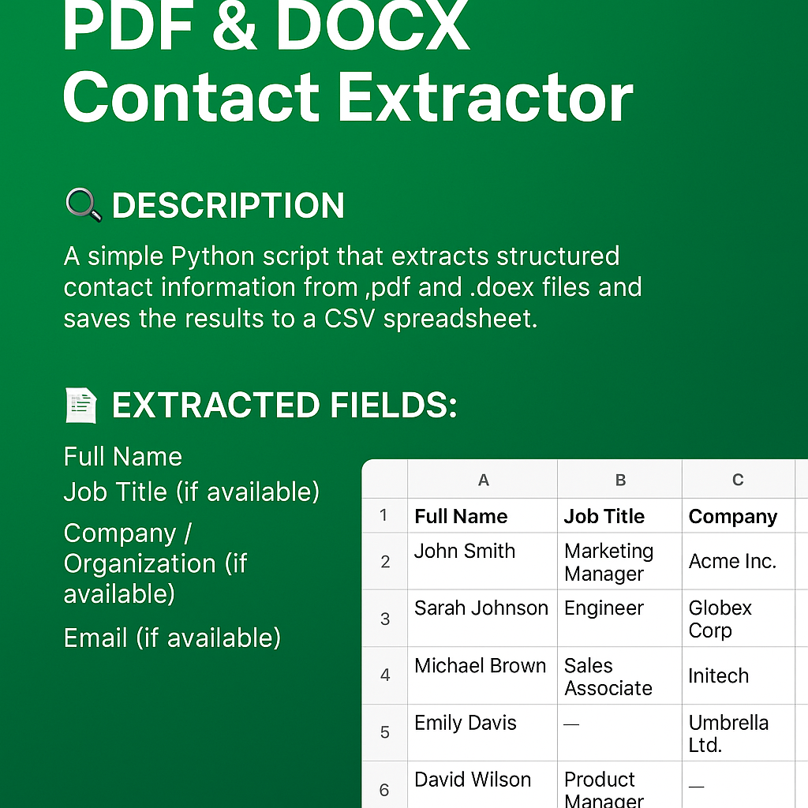

## 🔍 Description
A simple Python script that extracts structured contact information from `.pdf` and `.docx` files and saves the results to a CSV spreadsheet.

### 🧾 Extracted Fields:
- Full Name
- Job Title (if available)
- Company / Organization (if available)
- Email (if available)

---

## 🧠 Smart Extraction Logic

This script can handle:

- Entries in any order (e.g., Email before Title)  
- Labels with different punctuation (`Name -`, `Company:`, etc.)  
- Missing fields (e.g., no company or email — those fields will be left blank)  
- Extra spacing or noise between entries  
- Multiple entries per file, across multiple pages (PDF or DOCX)

---

## ▶️ Usage

### 🛠 Requirements:
- Python 3.8+
- Packages: `python-docx`, `pdfplumber`

Install required packages:

```bash
pip install python-docx pdfplumber


```
🚀 Run the script
Use the command line to run the script with either a DOCX or PDF file:

python extractor.py sample.docx

python extractor.py sample.pdf
